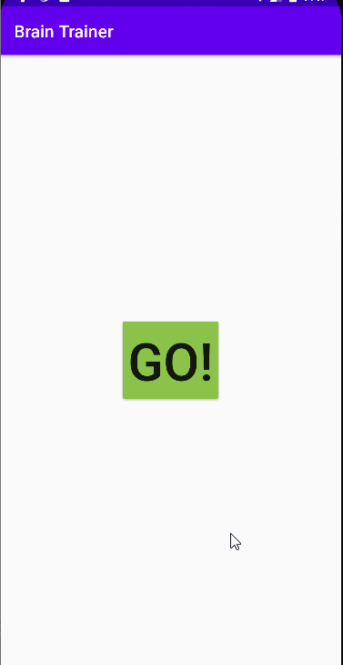

# Brain_Trainer

**Brain Trainer** is an android app that tests your correctness on doing addition in the range of 0 to 20 within the 30s.
Submitted by: **Lu He**
Time spent: **2** hours spent in total

## Technologies Used 
Android Studio, Java

## Process:
1. Clicking the **GO!** button would start the game.
2. The app would count down the time and store the total and the correct number of questions you do within the 30s.
3. When the clock reaches 0, a **PLAY AGAIN** button would pop up, and clicking it can restart the game.

## Video Walkthrough

GIF created with [LiceCap](http://www.cockos.com/licecap/).

